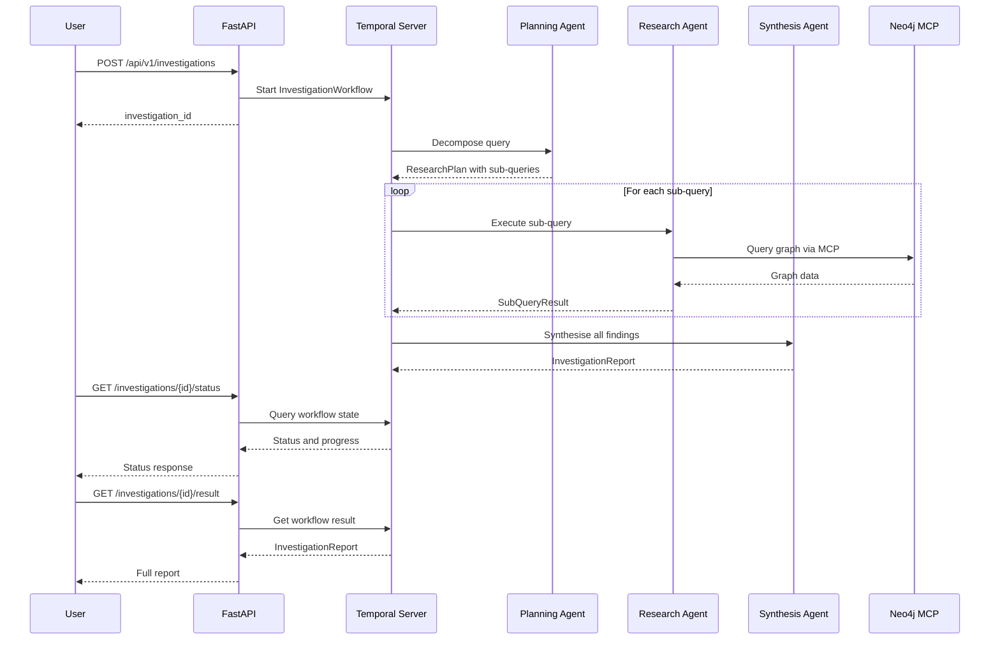

# FinCEN Chat

A small demo app that allows a user to interrogate the [FinCEN](https://github.com/jexp/fincen) data in Neo4j via natural language.

## Architecture and GenAI Features

This project serves as a practical demonstration of modern GenAI engineering patterns, focusing on reliable interactions with structured databases:

* **PydanticAI Framework**: The core agent is built using `pydantic-ai`, enforcing type-safe, structured outputs. This ensures the model's responses adhere strictly to defined schemas (e.g., separating findings from extracted entities).
* **Model Context Protocol (MCP)**: The agent connects to Neo4j via an MCP server. This provides the LLM with native tool access to query the graph database directly, allowing it to autonomously gather context.
* **Self-Reflection & Validation**: Domain-level validation is used to verify the LLM's output. For example, if the model indicates data was found but returns an empty answer, a retry is triggered, prompting the agent to correct itself.
* **Observability**: The agent is instrumented with Langfuse for detailed tracing, providing visibility into the broader LLM calls, tool usage, and prompt execution.
* **Evaluation**: An evaluation suite powered by `pydantic-evals` helps measure the agent's performance and accuracy against a dataset of test cases over time.
* **Durable Multi-Agent Orchestration**: A deep research investigation mode uses [Temporal](https://temporal.io) to orchestrate a three-agent workflow (planner, researcher, synthesiser) with durable execution guarantees. Each step is automatically retried on failure and completed steps are never re-executed.

### Investigation Workflow



## Usage

Provide a Google Gemini API key (or change the `MODEL` variable in `.env` to another provider and provide the relevant API key).

```bash
mise run setup     # Boot Docker services and load FinCEN data
mise run run       # Start the FastAPI dev server
mise run teardown  # Stop services and delete local data
```

> Investigate potential money laundering networks linking offshore shell companies in the British Virgin Islands to high-value real estate purchases in Miami and New York between 2018 and 2022. Map out the key front companies and financial intermediaries involved.

Is a good example of a query for investigation.

## Security
`.env` doesn't contain any real secrets and I wanted to keep manual configuration to a minimum, hence why it isn't in `.gitignore` (or, even better, a secrets manager isn't used).

The guardrails are very limited and basic at the moment but the model will decline to answer many messages that aren't related to the FinCEN data.

The evals have some failures (93% pass rate)- I'll address these at some point soon.